# Aye Big Bender

## Concept

Aye Big Bender is a project built around the concept of light and shadow: a pavilion whose geometry is a direct result of incident sunlight data in a particular location, and whose construction averages the incident amount of sunlight within, over the course of time.

The pavilion is constructed with metal rods, parametrically designed and robotically bent. These thin rods allow the parametric lines of the pavilion to appear as high-contrast shadows within and immediately around the pavilion, yet for the external or distant observer, have an almost transparent effect within the landscape.  

By embedding data within form in this way – in this case, incident sunlight data as total amount of shadow cast, temporal data of an immaterial factor is made material; permanent.

## Vision and design

### Site location: Valldaura

We choose Valldaura Lab as our pavilion site and location for sunlight analysis.  Valldaura is a self-sufficient research centre in Barcelona, producing energy, food and things, and develops projects and academic programmes in association with leading research centres around the world.

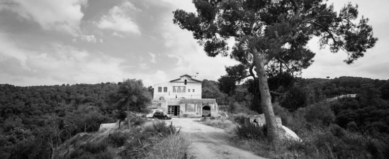

### Solar analysis

The radiation reaching Earth’s surface can be represented in a number of different ways. Global Horizontal Irradiance (GHI) is the total amount of shortwave radiation received from above by a surface horizontal to the ground.

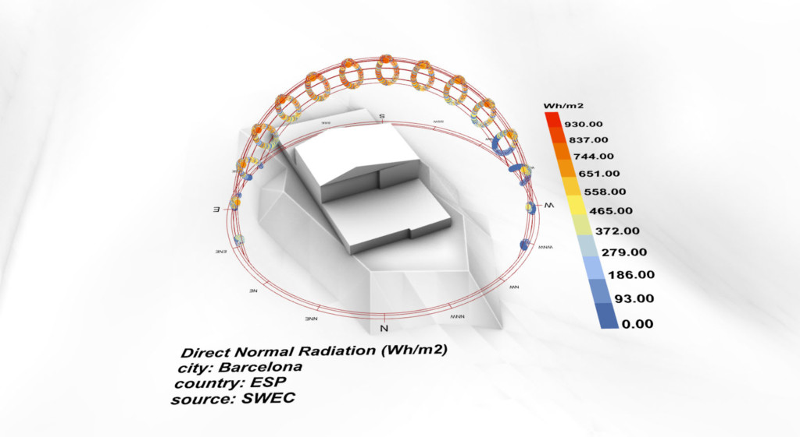
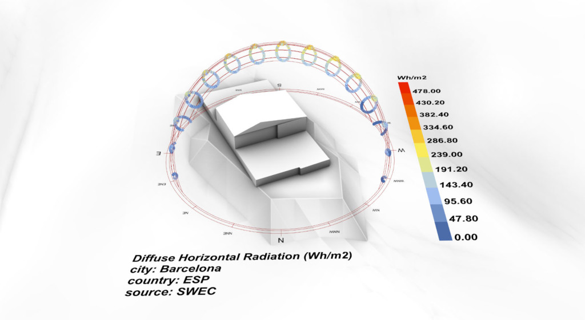
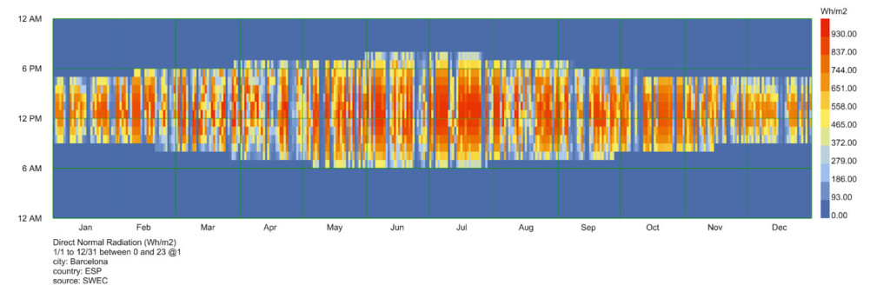

### Shadow study

The direct sun hours on the ground are affected by the building and incident surface.  A double-curved surface of 11.5 meters across and 3.2 meters high was set up as a prototype of a pavilion, in order to collect solar data from the environment.

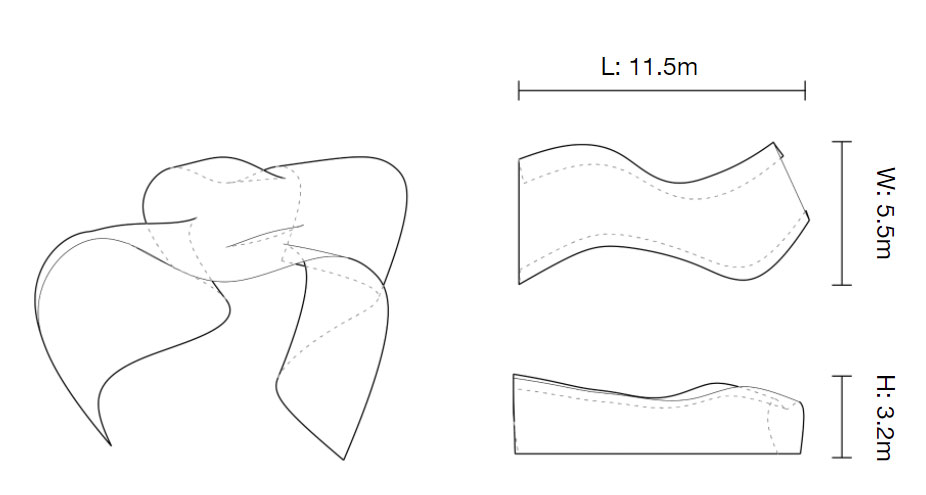
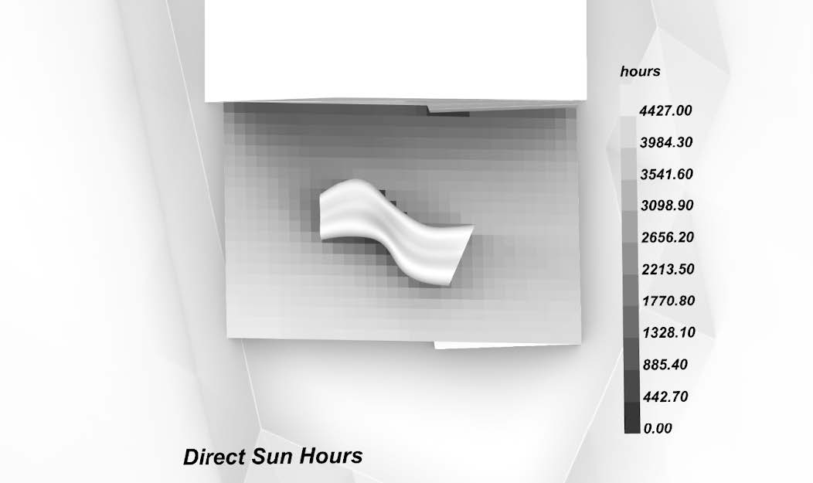
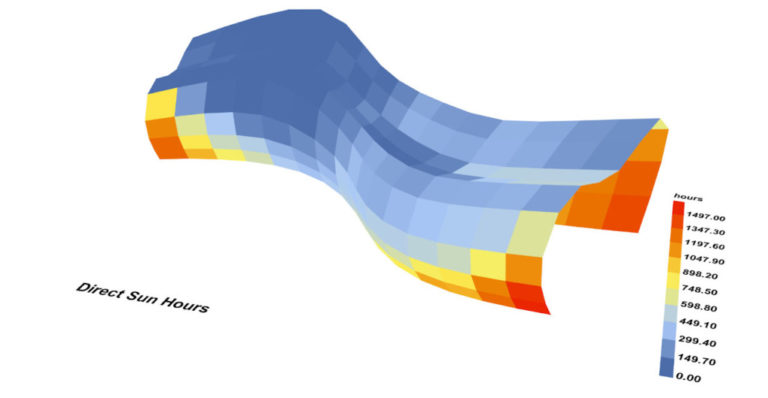
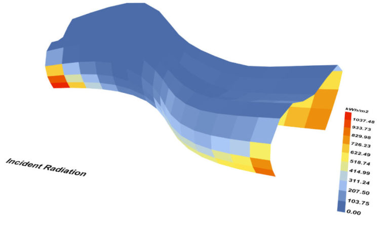

Parameters for estimating total amount of sunlight on an area include direct sun hours and incident radiation. We sought to embed this data to form a rebar frame with a gradient: areas with higher amounts of sunlight would have a higher density of coverage and therefore shadow.  In this way, the total sunlight received by any area inside the pavilion would be averaged with that of any other area, over time.

### Project development

The structure of the pavilion can be seen as a series of longitudinal curves that run from the ground of one side of the pavilion, over the roof, to meet the ground again on the other side.  These longitudinal curves are connected by a series of transversal curves which zigzag between the longitudinal curves, connecting them along the length of the pavilion.  The density of these transversal zigzags is what provides most of the gradient shadow.

There main iterations in the project design were longitudinal subdividing, curve division, offsetting alternate rows and automatically generating transversal curves. The folded plate structure and transversal curves provide more stability for standing as well as against wind resistance.
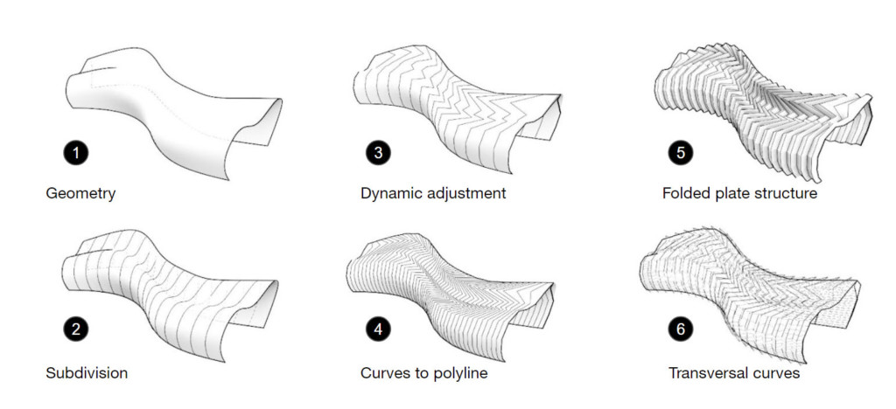
(vid)

## Robotic exploration

### Process constraints

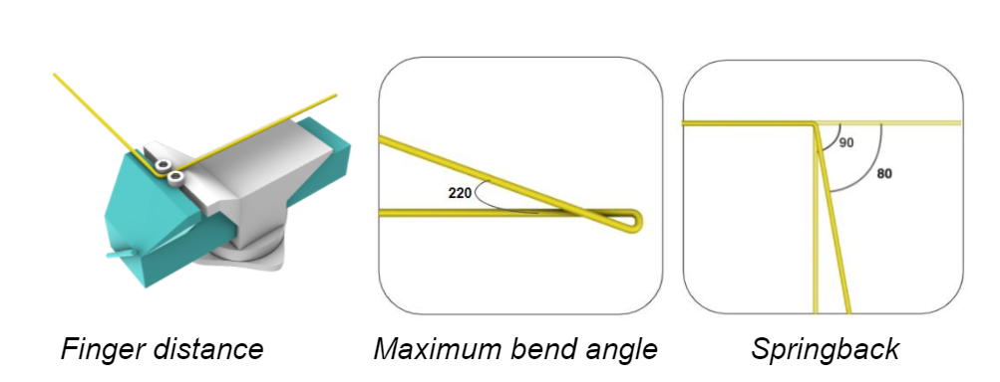

Springback – the elastic deformation part of a bend, which reverts once the bending force is removed. For a 4mm rebar, the plastic component varies with bend angle.  After multiple tests, we settled on an average overbend of ten degrees to give the closest desired result within the timeframe we had to plot this variation.

Maximum bend angle – how far the 4mm rebar can be bent without breaking.  We found this to be 220 degrees.

Distance between fingers – we use ‘fingers’ to refer to the two protrusions on the end effector, between which the rod is braced and bent.  The distance between the fingers is a key parameter as it controls the accuracy of the bend. Upon our manual studies we arrived at a conclusion that a 6mm gap between the two fingers provides enough tolerance for the robot target, as well as a good level of accuracy of the bend.

### End effector

Most examples of robotic rod bending use the robot to pick and place rods, and a static bending machine.  We drew inspiration from an innovative project by Maria Smegielska in which the rod bending tool was instead attached to the robot arm. Our tool and utilisation took this further by being able to effect three dimensional bends in the rods, as opposed to only planar bends.

In order to mount the tool on a robot we had to make the tool compact and lightweight. An aluminum block was milled to accommodate screws to mount on the robot and holes tapped to accommodate fingers, which were large head M8 bolts.

### Table setup

The table setup is a result of the vision to have minimal tools while making use of the robot’s maximum potential. Three major pieces of hardware are used in the process: a vice with a channel, a level guide, and an end effector on the robot.

## Robotic Simulation

(vid)

## Fabrication

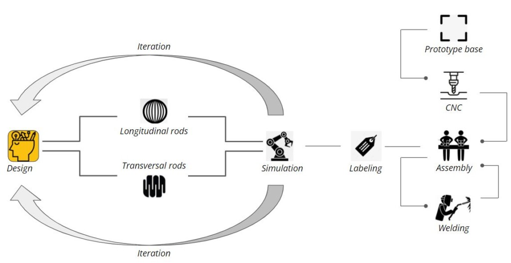

The design was iterated continuously through the process of making the end effector, judging the limitations of the rods, robot arm and environment set up, and how long each of these iterations took in relation to how much time there was to finish the project.

The intention was initially to weld bent rods together while other rods were still being bent, and this could be a good solution for larger versions of the pavilion.  For our workflow, we bent all rods then made the 200+ welds in a single afternoon.

To present the scaled prototype, straight sections were added to the ground side of each longitudinal curve, and their position drilled into a base board using CNC milling.

## prototype

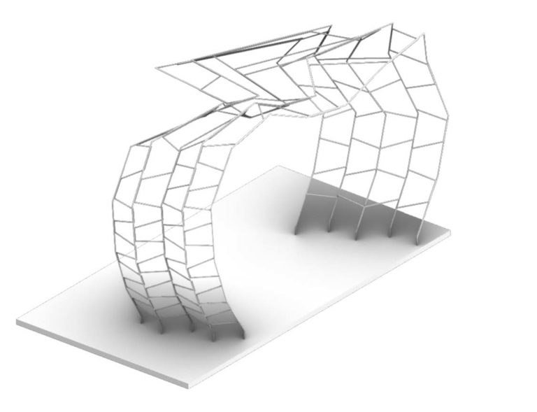

As a proof of concept, we fabricated one part of our design in 1:20 scale. Using 4mm rebar at this scale provided the necessary structural stability and the perception of being light.

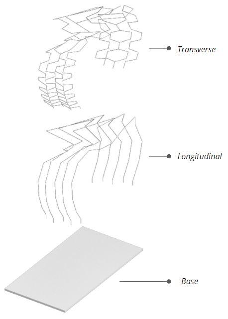

The prototype is essentially two sets of components: longitudinal and transverse. The transverse members provide the structural stability and the longitudinal members act as a guide to achieve a certain shape.

### Geometric division

For the purpose of robotic fabrication the members had to be split into smaller lengths to avoid collision with the robot and its surrounding environment. At this point we had to introduce a labeling system to make logistics easier.

Each section was labeled with the code ‘S’ and suffixes ‘L’ and ‘T’ were added to denote longitudinal and transverse members of respective sections. The number suffixes indicate the sub members.

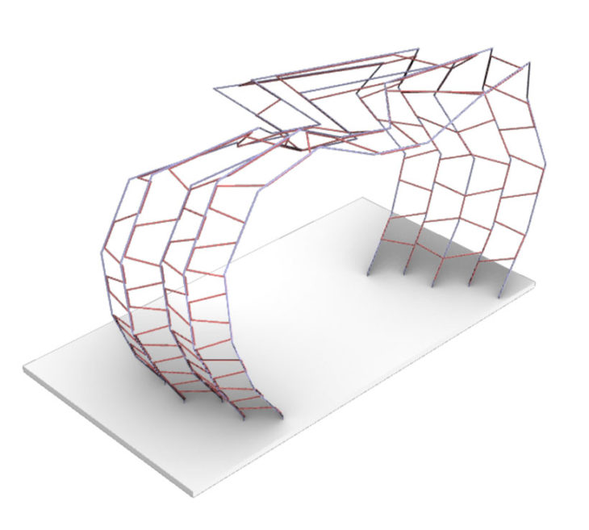

## Collision

Even with sub-division of members there were still collisions because of few complex members. Therefore, these members had to be further subdivided.

### Welding

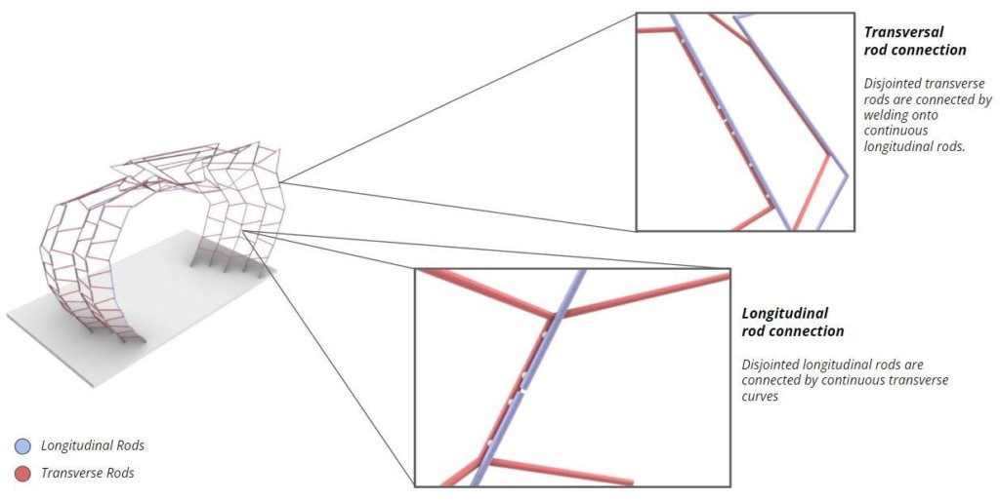

## Video

(vid)

## What next?

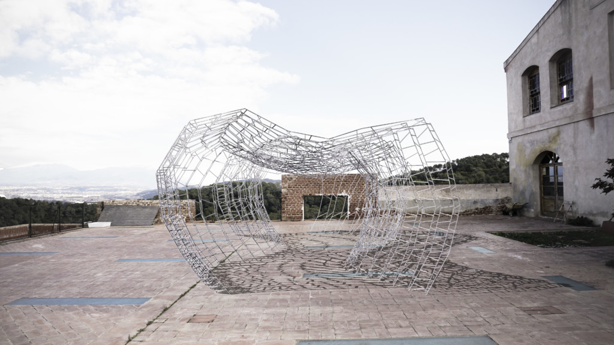

> Aye Big Bender // STUDIO I is a project of IAAC, Institute for Advanced Architecture of Catalonia developed at Master in Robotics and Advanced Construction seminar in 2021/2022 by:
Students: Shamanth Thenkan, Grace Boyle, Huanyu Li
Faculty: Raimund Krenmueller
Faculty Assistant: Marielena papandreou
