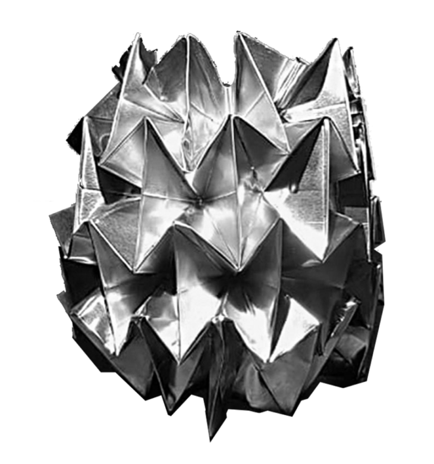
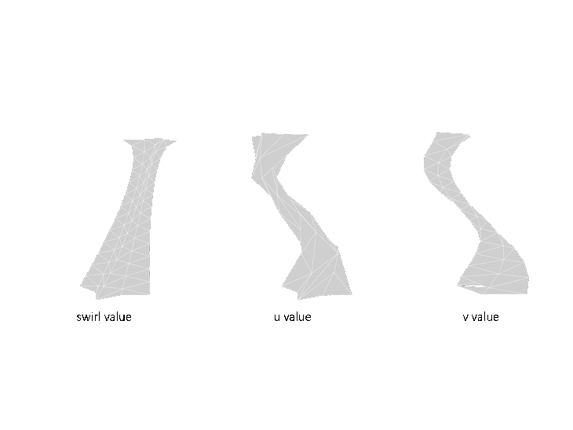
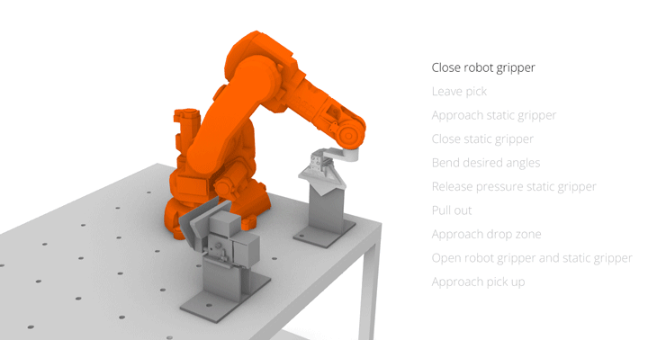
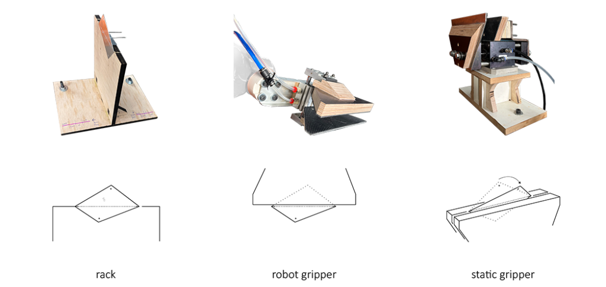

# BRIDGE BETWEEN TWO LEVELS

## Miura Fold

Where the idea of the geometry came from:

The changes in swirl, ‘v’ and ‘u’ values affected the proportions of the units, difficulty of the assembly

of the pieces, strength of the general geometry.

## Nesting

(img)

## Fabrication

## Robotic Bending

The bending of the plates is the part of fabrication that is being done by the use of the robots. This is because the bends require a high accuracy on the angle what can be provided by the robot. Also the speed of folding is a lot faster than bending it by hand. The robot bends 301 pieces with a maximum duty cycle of 27 second a plate and a total fabrication of 121 minutes.

(vid)

## Hardware

The hardware consists of three main parts which each have a role in the robotic setup:

1: The rack: A rack with two pins to hold the material on the right place for the pick up.

2: Robotic gripper: The tool on the robot that grips the plate from the rack and bends it together with the static gripper. It is made from plywood in CNC with a handmade steel plate to strengthen it while folding.

3: Static gripper: This grips the other side of the material while bending it. It is made from the same materials as the robotic gripper

### Assembly

To assemble all the pieces with the bracket pieces the rivet gun is used. This tool makes it possible to connect the pieces from the outside with a clean finish.

(vid)

## Outlook

This fabrication method stands out for its speed and ease of assembly. The flat sheets structural capacity increases with the folds and forms a light weight structure. This method can be used to build geometries with self-support solidarity and make it light- weight.

Creating a structure with:

* Being able to create structure giving many folds in a complex relation
* Using very less material
* Fully automated robot bending of the pieces.
* Being able to assemble this from outside

>Bridge between two levels is a project of IAAC, Institute for Advanced Architecture of Catalonia developed at Master in Robotics and Advanced Construction in 2021 by students Vincent Verster, İpek Attaroğlu and Abanoub Nagy Abdou Mikhail, and faculty: Raimund Krenmueller, Luciano Carizza and Marielena Papandreou
