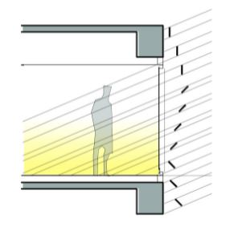
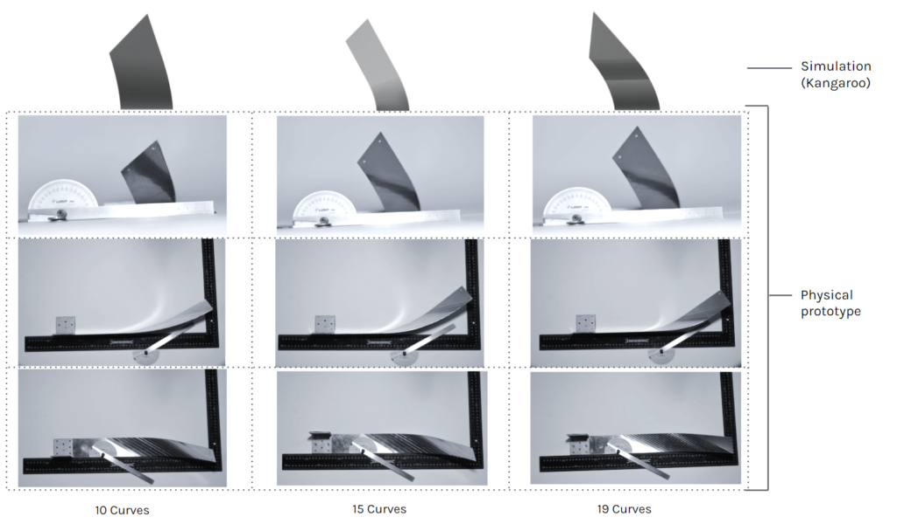

# Distorted Louvers

## Abstract

In the world’s current struggle with global climate change, it has become the  responsibility of the building industry to adapt, innovate and reduce its contribution to the growing emissions entering our atmosphere.

On an architectural scale, one of the most pressing challenges is a building’s ability to carefully reduce solar gain whilst maximizing indoor daylighting. This paradoxical struggle is ripe to be addressed with computational design and its ability to leverage large amounts of data and output a desirable solution.

This project focuses on using a computational approach to designing the louvers of a façade and leveraging robotics as a means of their fabrication while studying methods to approximate material behaviour.

## Global Context

*Image Source: NASA’s Goddard Institute for Space Studies*

Our planet is in danger. Scientific evidence for warming of the climate is unequivocal, as mentioned in the Intergovernmental Panel on Climate Change. As a result of human activities, global warming is an increasingly pressing problem that is becoming ever-present in all facets of life. According to NASA, the average temperature is consistently rising by 1.5°C every few years, creating numerous catastrophes across the globe – a warming ocean, rising sea levels, shrinking ice sheets, declining arctic sea ice, glacial retreat, ocean acidification to name just a few of those known.

This situation is raising the question of what we can do as architects and engineers.

## Architectural Context

Looking at the building scale, lighting and cooling consume on average 53% of the energy in office spaces according to the U.S Energy Information Administration.

In the coming years space cooling will become the biggest factor in growing electricity demand. A well-calculated and designed façade element can be an answer for electricity consumption and improving building performance.

Within the construction sector, we can see numerous examples of façade elements working as shading devices, many of them designed as systems of discrete strips. These louvers are efficient for controlling light and, as an added benefit, allow for the creation of aesthetic effects.

In this project, horizontal and continuous façade elements on the southern facade are utilized to achieve a design that shades the building in the hotter seasons while allowing interior illumination during the remaining parts of the year.

## Architectural Response

Perspective from street level

The site investigated in this project is located in Barcelona, specifically one of the IAAC buildings, Pujades 51-55, which has a southern façade completely covered by glass.

*Site Plan*

*Elevation Perspective*

The analysis for the solar radiation is calculated by the Ladybug component.

*Pre-Design Solar Radiation*

*Post-Design Solar Radiation*

## Louver design

*Angular variation allows for better control of light and solar radiation*

Effective solar shading devices depend on orientation of the louvers. As investigated in the project, different angles and densities of the louvers bring different light intensities. For better control of light, the angles of the louvers can be designed in a variegated fashion (where they can be twisted) according to parameters like the direction of the facade, program of the interior, etc. While some interior programs require low intensity of light, some require medium or high intensity, this also creates a connection between facade design and the building functionality.

## Geometry Exploration

In parallel with material explorations, several creasing patterns and geometry studies were conducted to understand the form in relation with the creasing angles, number of creasing curves, valleys, mountains, etc.

Using Delaunay triangulation for physics simulations, alternating mountain and valley crease patterns were simulated. In these explorations, mountains and valleys are defined. Mountain signify downfold (crease moves upwards similar to mountain) and valley signify upfold (crease move downwards similar to a valley).

*Delaunay triangulation simulation with mountains and valleys*

Due to the limitation of our setup, i.e. creasing is possible only on the side, mountains and valleys cannot be created on the same strip. As a result, this exploration couldn’t be adapted in the current setup of this project. However, it has the potential to be implemented in future developments.

In the following study, valley creasing on a strip of sheet metal was explored using Kangaroo physics simulations. Different curves and patterns were simulated to study global deformation and resulting forms.

**Series 1**

*A series of line curves on a strip model (60X500mm)*

*Different intensities of fold achieved on simulation with 50%(90 degree) fold intensity*

*Curves design explored on strip model((60X500mm) simulation*

*Simulation of strip with 30%(54 degree) fold intensity*

*Curves with higher curvature and a steep angle design explored on strip model((60X500mm) simulation*

*Simulation of strip with 30%(54 degree) fold intensity*

## Fabrication

Exploration started with a tile cutter in an attempt to achieve creasing on metal strips.

The first attempt consisted of origami inspired lines which helped us to bend the Galvanized Iron (GI) strip into a curved piece of metal.

*Material – 0.5 mm thick GI*

*Investigation of tile cutter tooling*

After successful results from the above experiment, the cutting/creasing wheel was taken from the tile cutter and used as part of a hand tool in the second experiment.

*Custom made hand tool with creasing wheel (tile cutter wheel)*

*Curves experimented over metal strip with hand tool*

For the second experiment, curved lines were tested on a GI strip and as an outcome a double curved metal strip was achieved.

*Material – 0.5 mm thick GI*

Due to the success of the first two experiments, the project proceeded with the cutting wheel for the robotic fabrication process.

The foundation of the idea was to generate pressure over a moving metal strip to achieve creases of different intensities depending on the amount of the pressure applied. The movement of the strip is performed by the robotic arm.

## The setup

>1 Gripper
2 Hydraulic Press
3 Wheel Cutter
4 Bathroom Scale
5 Platform for Strips
6 Robot ABB 140

*Robotic Setup*

The gripper is the end-effector mounted over the robot. Robot grabs the strip and moves it along the creasing wheel, similar to using a sewing machine.

### 1.1 Gripper 1.0

The gripper is the end-effector mounted over the robot. Robot grabs the strip and moves it along the creasing wheel, similar to using a sewing machine.

The gripper design went through several iterations. The first end effector was a U Shape with each end having a suction cup of 50mm diameter. The idea was to grab the strip along the length at 2 points, to avoid the twisting of the strip while creasing.

*First end-effector design(Gripper 1.0). Frame material – 30X30 mm aluminum profile*

A couple of problems were discovered with this end-effector:

a. The U-shape of the gripper constrained the movement of strips around the wheel.

b. Because of its width it occupied ~50% of the strip length, which reduced the creasing area drastically.

### 1.1 Gripper 2.0

Learning from the previous gripper design, Gripper 2.0 was fabricated as a 11 mm aluminum plate 60mm X  203mm installed with three suction cups (30 mm dia.) fixed in an offset pattern, which hold the strip. This 3 point contact mitigates slipping and twisting while holding the strip.

*Final end-effector.(Gripper 2.0)*

### 2. Hydraulic press
A 10 ton hydraulic press and mounted a custom made adaptor mounted under the press cylinder were used to apply pressure to the material. The hydraulic press can be adjusted at different pressure limits and results in a crease of different intensities.

### 3. Wheel cutter

A custom made aluminum adapter was fabricated and fixed under the press cylinder. As the strip is fed under the cylinder, the wheel starts to roll and the metal strip creases as it passes through.

### 4. Digital Weight-Scale
To analyze creasesing behaviour and quantify it with respect to the load applied by the hydraulic press, a digital weight scale was fixed under the hydraulic press (limit – 150kg). Since the design only required subtle creases of soft and small gauge material (0.5mm thickness aluminium), the required load was minimal. Weight/press load application exploration was also a part of test & trial fabrication (explained in further detail below)

### 5. Platform for the strips
A custom made wooden platform with a 45° resting angle for the strip was used. This was the most convenient setup explored with the existing robot setup.

### 6. The Robot
An ABB IRB-140 with an IRC5 controller and a payload of 6kg was used for this project.

**Hand Testing**

After the wheel adapter installation over the hydraulic press cylinder, several hand tests were performed to understand the:

* Material behaviour
* Intensity of the crease bends at different levels of loads.
* Limitations of the setup

First, hand tests over hydraulic press were performed using plywood as base.

As the hydraulic press works at a scale of thousands of kilograms, no means of accurate load measurement was readily available due to our load application being much smaller (within 100kg). We created definitions with respect to the times the hydraulic press handle is pressed. Measuring the extension of the hydraulic press proved to be more accurate but needed in deconstruction of the frame for each measurement.

Wheel touches strip with no pressure = 0
Unit Quarter step in hydraulic press  = ¼ unit hydraulic pressure
Half step in hydraulic press = ½ unit hydraulic pressure
One step in hydraulic pressure = 1 unit hydraulic pressure

*Creasing tests were recorded for each pressure definition over the plywood base*

A test strip of 60mmX500mm 0.5mm thick with creasing lines was used. And hand fed over the hydraulic press. Each curve was creased at different pressures, starting from ¼ unit press, ½ unit press…. Up to 1 ½, at which the strip started to shear.

The above experiment assisted in understanding the limits to which we can extend our setup. Higher pressure gave a highly intense crease >10 degrees bend, but the pull pressure required to drive the strip along the creasing curve under this high pressure exceeded the robotic arm’s payload range. I.e. >6 kg.

Another hand test was performed with a foam base using a similar metal strip of 0mmX500mm 0.5mm thick with creasing lines.

The above experiment assisted in understanding the limits to which we can extend our setup. Higher pressure gave a highly intense crease >10 degrees bend, but the pull pressure required to drive the strip along the creasing curve under this high pressure exceeded the robotic arm’s payload range. I.e. >6 kg.

Another hand test was performed with a foam base using a similar metal strip of 0mmX500mm 0.5mm thick with creasing lines.

Similar hand tests were performed with the new weight scale setup, using a composite plywood and foam base.

All the hand tests were compared (plywood base and foam base), which helped us to decide the ideal setting of our setup.

As a conclusion of all the experiments, the following conclusions were reached:

* 5kg load had to be applied on the strip, due to which using hydraulic press became necessary and mounting the creasing wheel directly over the robotic arm was not possible.
* A foam base gives a higher crease angle – approx. 7° at ~6kg hydraulic press load – whereas a plywood base resulted in ~5° at the same press load. However, due to friction, the pull/push required with the foam base was higher than plywood base setup.

**Setup Constraint/Limitations**

During the whole process of creating the setup and explorations, some inaccuracies and limitations of the setup were recorded. Specifically:

* 1. Suction power of the end effector was limited to ≥6kg hydraulic press load. If >6kg load is applied, the suction cup cannot drive the strip through the wheel and as a result the strip starts to slip.

* 2. The measuring scale setup gave error at random states, and turned off during random stages of the testing and fabrication.

* 3. The prototype design had to function within the confines of the workspace’s limitations. Prior to the final iteration these limitations were addressed during the prototype’s design. As per the process, the workspace had 2 main limitations:

a. Robot Range

b. Area of the gripper, inside which the creasing cannot be performed

The angles of the curves have to be within the range where the robot can reach and it does not cross the end-effector area/line.

* 4. Hydraulic press setup had 2 types of movements (radial and lateral) which caused deviations in fabrication.

Radial movement is caused by the custom made adaptor fixed over the press cylinder.

Lateral movement is caused due to the press cylinder itself.

These movements result in deviation in creasing and double creasing during fabrication which eventually results in the strips becoming more bent than intended. There were attempts to alleviate these issues with jigs and clamps, but in the end they did little to solve the problems or created new ones.

Double creasing due to press cylinder movements

(vid)

## Final Prototype

### Design inference form Creasing vs bending  for computation

The creasing technique  produces a small degree of overall bend when compared to a bending machine. But with the accumulation of shallow creases it is possible to form metal sheets into double curved shapes in a controlled manner.

To visualise the bends with respect to the real life scenario we used physics simulation through kangaroo in the CAD environment to have fabrication comparisons.

The main factors that drove the bends in the strip were:

1. Number of creasing curves in the strip. This defined the intensity of the overall bend of the strip
2. Angle of each creasing curve. This can be used to drive the strip to bend in different axes.

Post fabrication, the fabricated strips were analysed and a comparison was structured to analyse the success of the research and better understand the deviations in fabrication and the whole setup.

*Design vs Actual comparison*

*Design vs Actual comparison*

As a conclusion of comparison between the design and actual fabricated pieces:

1. Strips with 10 curves and 15 curves are relatively identical to the design strip (Kangaroo Simulation model) in creasing bend angles and overall strip bending. Reference images above

2. Deviation in strips from 19 curves and above is incremental as the number of curves increases. Reference images above

The reason for deviations are concluded as happening due to the limitation of the setup(explained the blog earlier)  and mostly due to the lateral movement and radial movement of the press cylinder and its custom adapter. Overcoming those deviations will give precise results on the current setup.And a computational model accounting for the stretching of metal and local creasing deformations. studies on FEM simulations needed.

*Final prototype design*

The fabricated prototype offers a 1:5 scale mockup of the louvers on the façade. Not derived from the geometry of the architectural design directly, the prototype instead depicts a gradient of increasing manipulation and thus twisting. This gradual increase in crease density highlights the potential for manipulation whilst working in this smaller scale.

The final design consists of 9 louvers. Each louver is made of 2 identical creased strips riveted together. 

Ends of the louvers are fixed inside a metal frame made of 30X30 mm MS. For fixing the louver ends fork end bolt  connector is used, the bolt side is tapped in the frame and the fork end holds the strip.

*Louver connection detail*

## Way Forward

### Technical developments

During the whole project, a lot of space for upgradation/development had been observed, some of these include:

1. Better control over the creasing wheel, which would help in achieving precise creasing with better control over the applied pressure and minimizing deviation.

2. Automating the wheel rotation and wheel pressure, allowing fewer constraints in angles of lines and higher curvature and complexity for curved creases.

3. By using different types of wheels, various crease patterns, perforation or creasing can be generated on the metal strip.

4. Feedback loop for achieving precision in overall curvature. 

5. Large scale setup – can enable fabrication of more complex crease patterns, higher Gaussian curvature in double curved surfaces in larger size sheets/strips.

6. Scalability – Taking inspiration from metal bead roller, the strip area (hydraulic press area) can be increased to not be limited to strips. Possibilities can be very broad. Example – creasing large size metal panels for wall cladding, facade, etc.

### GEOMETRIC POTENTIAL

Increasing the creasing area opens possibilities for exploring sheet metal forming through crease curve origami simulations.

>DISTORTED LOUVERS is a project by MRAC 01 students Beril Serbes, Robert Michael Blackburn, Libish Murugesan, Arpan Mathe  during the STUDIO 1 seminar of the first term. Studio was taught by IAAC faculty Raimund Krenmueller, Marielena Papandreou, Luciano Carizza.
During the STUDIO I course, students had to explore::
Interaction of metals with light
Light metal craft and its application in architecture

## References
https://www.westsystem.com/wp-content/uploads/GougeonBook-061205-1.pdf

http://erikdemaine.org/papers/OrigamiSimulator_Origami7/f

https://www.grasshopper3d.com/group/kangaroo/forum/topics/new-tutorial-developable-strips-part-1

https://www.grasshopper3d.com/group/kangaroo/forum/topics/new-tutorial-developable-strips-part-1

https://www.researchgate.net/figure/Figure-Surface-discretisation-of-a-10-000-TEU-container-ship-Figure-Bow-sections-used_fig2_324656057

https://www.instructables.com/How-to-make-a-lifesize-wearable-Iron-Man-helmet/

https://hal.archives-ouvertes.fr/hal-02988760/document

The art and engineering of curved folding
