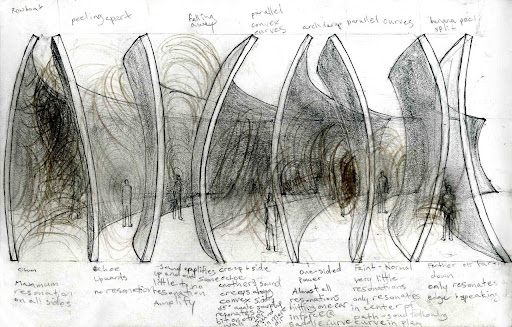

# Metal B***hes

During the STUDIO I course, students had to explore:

Characteristic of all sensations and perceptions that is specific to vision. Radiation that is considered from the point of view of its ability to excite the human visual system.

The use of light in a development aluminum process, we explore two different phenomenons, the Reflection and de dispersion of  light, with the purpose of creating layers of color in the material.

## AIM

*Experiential spaces birthing different resonations and divergent spatial cognition.*

The addition of grinding textures derived from the artworks of Richard Serra creates a visual disposition of the panels of the Pavilion, hence creating illusions depending on the way light hits the texture. The scale of a Pavilion helps us understand the usability and scalability of the Molding+Grinding process better.

## DESIGN
The design was an exploration in trying to work with complex shapes but at the same time try and inculcate some geometric modularity to it, for instance the Sydney Opera house uses certain sliced geometries from a bigger simpler geometry; i.e. a sphere, for it’s form.

The concept of self-solidarity geometries with varied spatial cognition comes from Richard Serra, his work with large scale sheet-metal installations and other art has highly influenced our design decisions.

*Spatial Cognition study by artbykla*

*Architectural rendering for the VRS Pavilion*

## MANUFACTURING WORKFLOW

*Workflow Idealization*

### Tool

The grinding tool available to us is Prevost TDG S2200R. We explored this tool manually on three different metal surfaces, with three different grinding bits. The tool was then used to create a manual texture library for us to refer from and make design and production decisions. The Texture Library also contains different type of sheet metals: Raw Aluminum, Brass & Raw Steel.

*Prevost TDG S2200R*

*Raw Aluminum Texture Pattern Library – 1*

*Raw Aluminum Texture Pattern Library – 2*

## End-Effector Design

The end-effector design began with looking at the angle at which the Prevost will be held, and the assembly. Regarding angle, the 90 degrees model was chosen because it resulted in less singularities and collisions in the grasshopper simulation.

*End-Effector design iterations*

Regarding assembly, we created mock-ups using MDF to determine what would be the ideal way to install onto the robot. Given that it will be mounted onto the robot as the last step, we chose the design that places the Prevost 173mm below the center of the ABB’s end-effector. The final end-effector was in aluminum, taking these tested dimensions and assembly method.

*Aluminum End-Effector close-ups*

### Grinding Flat Surface

The end-effector was put into test on flat surfaces first. Through this testing, we built an understanding of the bits, constructed a simple library of texture-variations that resulted from the different speeds and angles.

*Testing parameters for simple strokes*

*Testing parameters for designed pattern*

The initial parameters in consideration were speed and angle. The tests, however, informed us of the different natures (or tolerances) of the bits, as well as the nature of the surface (flatness). These considerations would affect our next iteration on curved surfaces.

### Molding

The molding was made by a process called metal stamping. In this process the punch draws the blank to form the shape while the blank holder controls the flow of metal into the die cavity.

We have two different molds, the first one was made with a high performance polyurethane and the second one was made with wood and MDF.

*Mold v_1.0*

*Mold v_2.0*

After the test with the first mold we noticed that the space between the bank holders and the shape needs to increase and we should find a way to avoid the aluminum movement in the punt movement, so we designed this mold to get the best result.

*Molding Results*

### Grinding Curved Surface

This is the final step of our production, as we put everything we have studied previously into testing. The robotic grinding on curved surfaces brought a number of unexpected challenges and called for improvisation such as re-adapting the end-effector for another function, milling.

The first biggest challenge we encountered was the discrepancy of curvature in the 3D model and the actual mold. The discrepancy caused potential crashing as well as inconsistent texture results.

### Initial Pseudocode

### Adapted Pseudocode

### Workflow Idealization

### Workflow Reality

### Surface Calibration explorations:
### 3D Scan using LiDAR

### Manual Point-Mapping

Within the constraint of – ø 3mm or ø 6mm, any bit could be used for the purpose of calibrating, marking, or even cutting the metal surface.

### Spring-back

Spring-back in the material helped the grinding process to address the inconsistent contact pressure.

### Grinding Test on Mold v_1.0

### GRINDING_VRS PAVILION

We took the understanding from the test mold:

1. safety measures
2. sheet spring-back 
3. manual surface calibration 
and proceeded to the next set of aluminum molds.

### The Pattern

The pattern is defined flat. It is then projected to the mold, translated into different bits and different plane rotations for the robotic grinding.

The stroke thickness is defined by the tilt.. We intended higher waves to have thicker strokes (thus, closer to 20°).

For rotary burr, speed would determine the thickness and nature of the stroke. Defining the angle was irrelevant.

### The Process

### Milling

The outline of the pieces had to be cut with higher precision. With the presence of ø 3mm and ø 6mm drill-bit, the tool upgraded to uphold the task of robotic milling.

### Callibrating for Milling

Milling required higher precision in surface calibration. Manual surface calibration, especially on curved surfaces, has limits to achieving this precision.

## Takeaways

The aim is to raise accuracy and shrink time-consumption,, especially in the two areas:

## Installation

## Scalability

Imagining curved geometries in bigger scales, carrying textures to redirect light.

------

Metal B***hes is a collaborative of IAAC, Institute for Advanced Architecture of Catalonia developed at Master in Robotics and Advanced Construction in 2021 by

Students: Mit Patel, Yeo Jeong Kim, Andrea Najera 

Faculty: Raimund Krenmueller, Marielena Papandreou, Luciano Carizza

