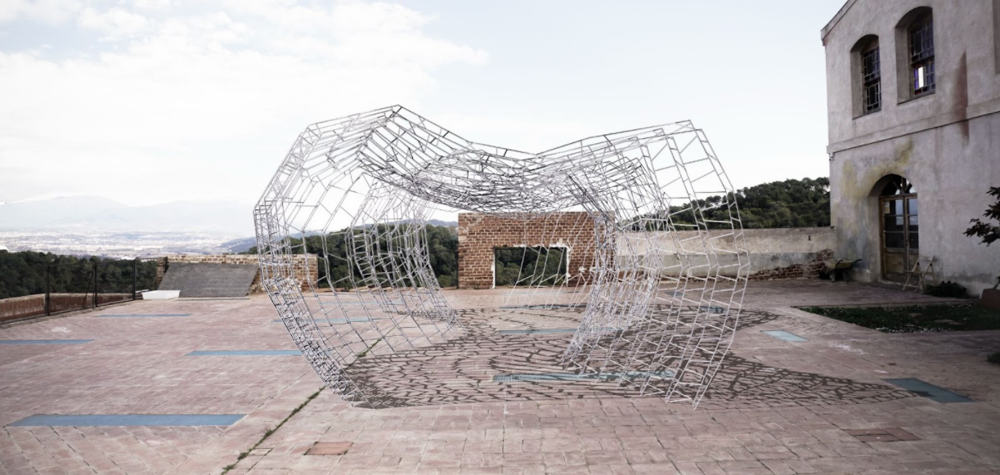
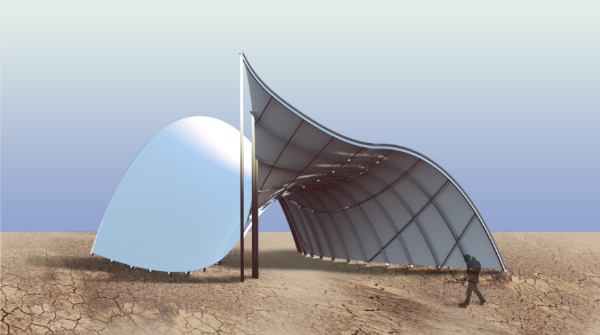
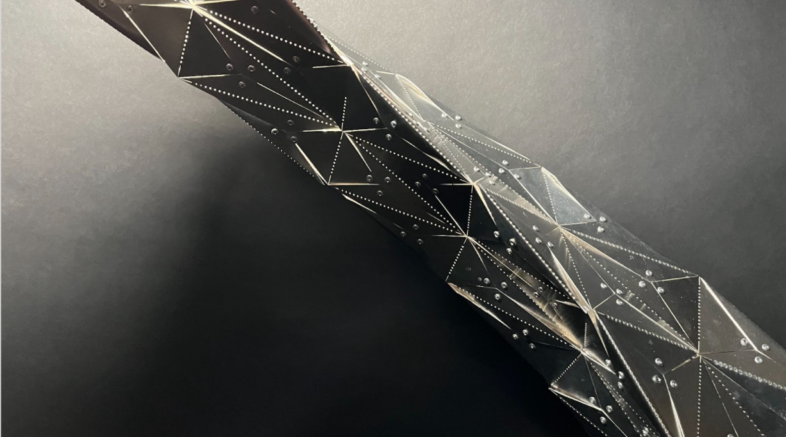
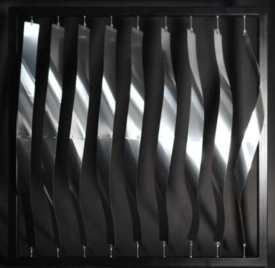
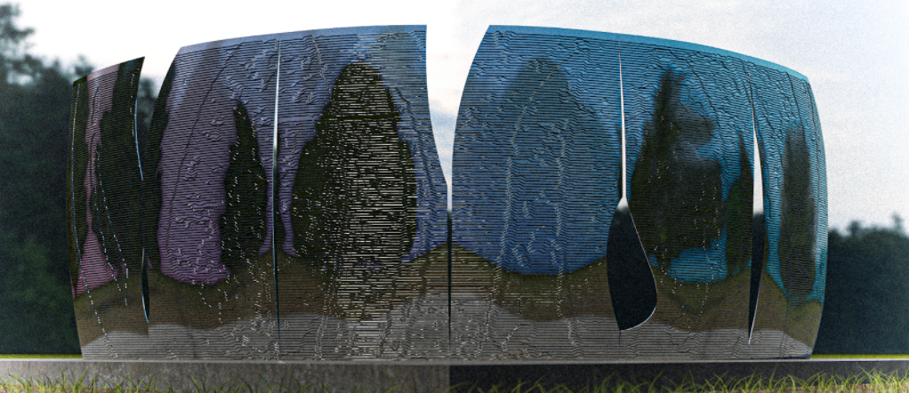

# Robotic-Craft-Light-Metals

Robotic Craft provided a framework for students to explore digital fabrication technologies and
workflows in architecture in the development of a design-and-make project, via a series of guided
exercises involving manual experiments, digital design, detailing, hands-on prototyping, robotic
processing and investigations of architectural visions. As a final physical artefact, 5 different groups built
a performative prototype in 1:1, using the tools and skills developed in the studio.

Aspects of geometry and computational design, joinery and structure, fabrication, assembly and
finishing were developed, with the ambition to generate novel aesthetic, spatial and performative
qualities.

Aye Big Bender

B(L)ending Studio

Folded Staircase

Louvres

Metal Bitches
